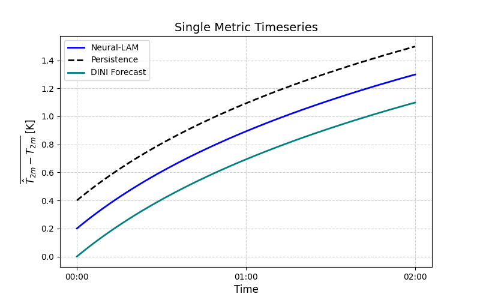
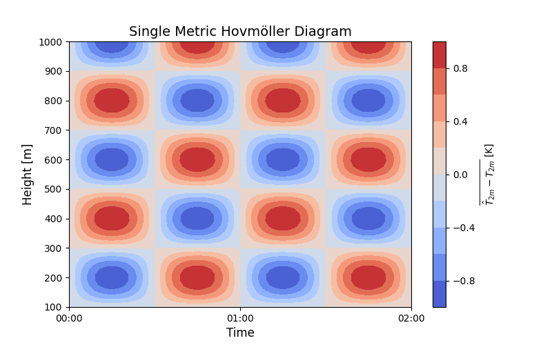
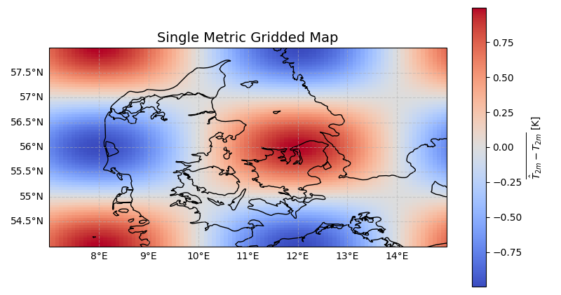
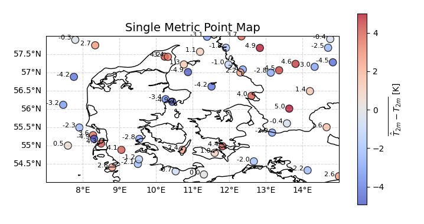

# mllam-verification
Verification of neural-lam, e.g. performance of the model relative to the truth, persistence, etc.

## General API patterns

- Every plot function should have ax = None as input argument. If no axes is provided, a new figure with appropriate settings/features (e.g. coastlines for maps) should be created. Otherwise, the plot should be added to the provided axes on top of the existing plot with a zorder = 10*n, where n is an integer. One can also specify zorder as input argument to the plot function to place the plot at a specific place in the plot hierarchy.
- Every plot function should have an include_persistence input argument, that defaults to True if it is possible to add persistence for the given plot type, and False if not. If include_persistence = True , but the plot doesn't support plotting the persistence an error should be raised.
- If needed, the persistence should be added beforehand to the dataset for which the statistics are to be calculated, such that one can call the calculate_pipeline_statistics function just with one dataset.
- Every plot function should take the metric to compute and plot as input argument.
- The functions shall be callable from JupyterNotebook/Python script and the CLI.
- The top-level plot functions should be named according to the plot they produce. They should not directly contain the logic to actually compute the metrics, but instead call other compute functions to do that.

- Placer validering af dimensioner/coordinater efter metric beregningen da denne beregning skal laves layzily i Dask og derfor sker beregningen ikke før data skal bruges i plottet.
- Giv plot funktionen x,y arg names der indikerer hvad der skal bruges som x og y
- Giv plot funktionen dataarrays hvor variablerne allerede er valgt ud -> fjern variabel input argumentet.
- Lav én compute pipeline statistics function som tager "metric" som argument og kan kalde metrik beregningen fra eksterne moduler. Tag udgangspunkt i den eksisterende compute_pipeline_statistics function i mllam-verification-old. 

### Example on python functions

In [mllam_verification.plot] there is an example on a plot function that plots the single-metric-timeseries plot

This plot function will first add persistence to the dataset for which one should calculate the statistics (only if needed), and then call a calculate_pipeline_statistics function.

This latter function will make use of statistics functions located in statistics.py. The statistics.py functions will be able to call statistics function from external packages, e.g. the `scores` python package, by simply specifying the package as an input argument, and add relevant cf compliant cell_methods.

## Python API
The mllam_verification package should be structured according to this directory structure. As an example, the above plot function plot_single_metric_timeseries will be located in mllam_verification/plot.py .

```
.
├── mllam_verification
│   ├── operations
│   │   ├── __init__.py
│   │   ├── loading.py                  # Contains functions for loading data
│   │   ├── saving.py                   # Contains functions for saving data and plots
│   │   └── statistics.py               # Contains functions for computing statistics e.g. mean, std, etc.
│   ├── __init__.py
│   ├── __main__.py                     # Entry point of the package
│   ├── argument_parser.py              # Contains CLI argument parser
│   └── plot.py                         # Main script for producing plots
└── tests
    ├── conftest.py
    ├── unit
    │   ├── conftest.py
    │   └── ...
    └── integration
        ├── conftest.py
        └── ...
├── pdm.lock
├── pyproject.toml
└── README.md
```

## Supported plots
The following is a first draft on the plots we want to make available in the mllam-verification package and what they support:
| Name                        | Plot function name                  | Example          | Grouped | Elapsed | UTC | Multi | Multi model | Multi variable | Point | Regular |
|-----------------------------|-------------------------------------|------------------|---------|---------|-----|-------|-------------|---------------|-------|---------|
| Single metric timeseries    | `plot_single_metric_timeseries`    |  | ✅¹| ✅¹| ✅ | ✅ | ❌ | ❌ | ✅ | ✅ |
| Single metric hovmöller     | `plot_single_metric_hovmoller`     |  | ✅ | ✅ | ✅ | ✅ | ❌ | ❌ | ✅ | ✅ |
| Single metric gridded map   | `plot_single_metric_gridded_map`   |  | ✅ | ❌ | ❌ | ❌ | ❌ | ❌ | ❌ | ✅ |
| Single metric point map     | `plot_single_metric_point_map`     |  | ✅ | ❌ | ❌ | ✅² | ✅² | ❌ | ✅ | ✅ |

¹ without persistence\
² maybe not a good idea e.g. if points overlap in grid.
